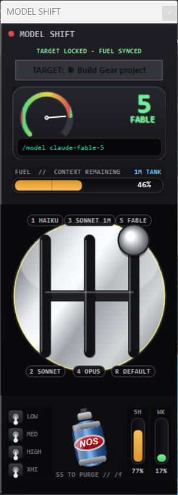

# 🏎️ Gearbox

[](https://github.com/Aaryanxvi/GEarbox/actions/workflows/test.yml)

Gearbox is a physical gear-shifter for coding agents. It's a floating H-pattern shifter that drives model/effort switching in a running session by injecting the commands into your terminal — plus live instrumentation: a fuel gauge for the context window and utilization bars for your rate limits. Switch models by dragging a stick, not by typing.

Two flavors:
- **`shift-gui.ps1`** — for **Claude Code**. Drives `/model`, `/effort`, `/fast`.
- **`shift-gui-codex.ps1`** — for the **Codex CLI**. Drives `/model`, `/reasoning`, `/compact`. Gears **auto-sync** to whatever models you actually have (read from `~/.codex/models_cache.json`); fuel and usage bars read straight from the session file — no API calls.

Windows runs the full GUI. macOS and Linux get a terminal launcher (`gear.sh`).

<p align="center">
  
</p>

## 🚦 Quickstart

```powershell
git clone https://github.com/Aaryanxvi/GEarbox.git
cd GEarbox
powershell -sta -File shift-gui.ps1
```

Click your Claude Code terminal once so Gearbox locks onto it (shown under `TARGET`), then drag the stick into a gate. That's it.

## ⚙️ How it works

Gearbox never talks to Claude directly. It targets a terminal window and types into it, exactly as if you'd typed the slash command yourself:

- **Targeting** — a focus poller (`user32.dll` `GetForegroundWindow`) tracks the last non-Gearbox window you touched. That window is the target; switching between terminals re-targets automatically.
- **Injection** — on a shift, Gearbox foregrounds the target (restoring it only if minimized, never resizing it) and sends the command via `SendKeys` + Enter.
- **Fuel gauge** — reads the target session's transcript under `~/.claude/projects`, sums the newest `usage` entry (`input + cache_creation + cache_read + output`), and renders it against the model's context window (200K for Haiku, 1M for everything else; the 33K autocompact buffer is subtracted for Sonnet to match `/context`).
- **Usage bars** — call the same OAuth `usage` endpoint the CLI uses, with the token from `~/.claude/.credentials.json`. Cached for 5 minutes, fetched off-thread so the UI never blocks.

Nothing leaves your machine. No dependencies beyond PowerShell 5.1 (ships with Windows) and the Claude Code CLI.

## 🔧 Installation

### Windows (GUI)

Clone or [download the ZIP](https://github.com/Aaryanxvi/GEarbox/archive/refs/heads/main.zip), then run:

```powershell
powershell -sta -File shift-gui.ps1
```

`-sta` is required — WinForms needs a single-threaded apartment. If PowerShell blocks the script, allow it for that one session:

```powershell
Set-ExecutionPolicy -Scope Process -ExecutionPolicy Bypass
```

### Codex CLI (GUI)

```powershell
powershell -sta -File shift-gui-codex.ps1
```

Same shifter, wired for Codex. Gears are built at launch from your `~/.codex/models_cache.json` — you get exactly the models Codex offers you, in priority order. To add a **legacy** model (one Codex only exposes via `codex -m <slug>`), drop its slug into the `$extraModels` array at the top of the script; leave it empty and no legacy gears show. Effort levers send `/reasoning`, the NOS bottle sends `/compact`, and the fuel gauge + 5H/weekly bars read from the session rollout file (no network, no credentials).

### Launch from inside Claude Code (`/gear`)

Copy the bundled command into your Claude commands directory and point it at your clone:

```powershell
mkdir $HOME\.claude\commands -Force
copy commands\gear.md $HOME\.claude\commands\
```

Edit `$HOME\.claude\commands\gear.md` so the `-File` path points at your `shift-gui.ps1`, restart Claude Code, and `/gear` launches the dashboard (with a guard that won't spawn a second copy).

### macOS / Linux (terminal)

```bash
chmod +x gear.sh
./gear.sh            # interactive gear menu
./gear.sh 3          # launch straight into gear 3
./gear.sh 5 xhigh    # gear 5 at xhigh effort
```

`gear.sh` launches a fresh `claude` in the chosen model/effort. Inside a live session, `/model` and `/effort` are the gears.

## 📊 The dashboard

| Control | Command sent | Notes |
|---------|-------------|-------|
| Gear stick (gates 1–5, R) | `/model <name>` | Drag into a gate to shift |
| Effort levers (left) | `/effort low\|medium\|high\|xhigh` | Flip a lever to set thinking depth |
| NOS bottle | `/fast` | Toggles fast mode |
| Tachometer / fuel gauge | — | Context window remaining |
| 5H / WK bars (right) | — | 5-hour and weekly rate-limit utilization |

### 🕹️ Gears

| Gate | Model | `/model` arg |
|------|-------|--------------|
| 1 | Haiku 4.5 | `haiku` |
| 2 | Sonnet 5 | `sonnet` |
| 3 | Sonnet 5 (1M context) | `sonnet[1m]` |
| 4 | Opus 4.8 | `opus` |
| 5 | Fable 5 | `claude-fable-5` |
| R | Default | `default` |

## 📦 What's inside

- `shift-gui.ps1` — the Windows GUI for Claude Code. Single file, WinForms, no dependencies.
- `shift-gui-codex.ps1` — the Windows GUI for the Codex CLI. Auto-syncs gears from your model cache.
- `gear.sh` — the macOS/Linux terminal launcher.
- `commands/gear.md` — the `/gear` slash command for Claude Code.

## ⚠️ Notes & limitations

- **Effort isn't logged to the transcript**, so the levers can't reflect your current setting — they start neutral each launch and only *set* effort when clicked.
- **Targeting follows focus.** If a shift does nothing, click your Claude terminal so it becomes the target (its title shows under `TARGET`).
- **Transcripts are read tail-first** (last 1 MB, byte-seeked) so the gauge stays responsive even on multi-megabyte session files.

## 📄 License

MIT — see [LICENSE](LICENSE). Use it, fork it, ship it.
